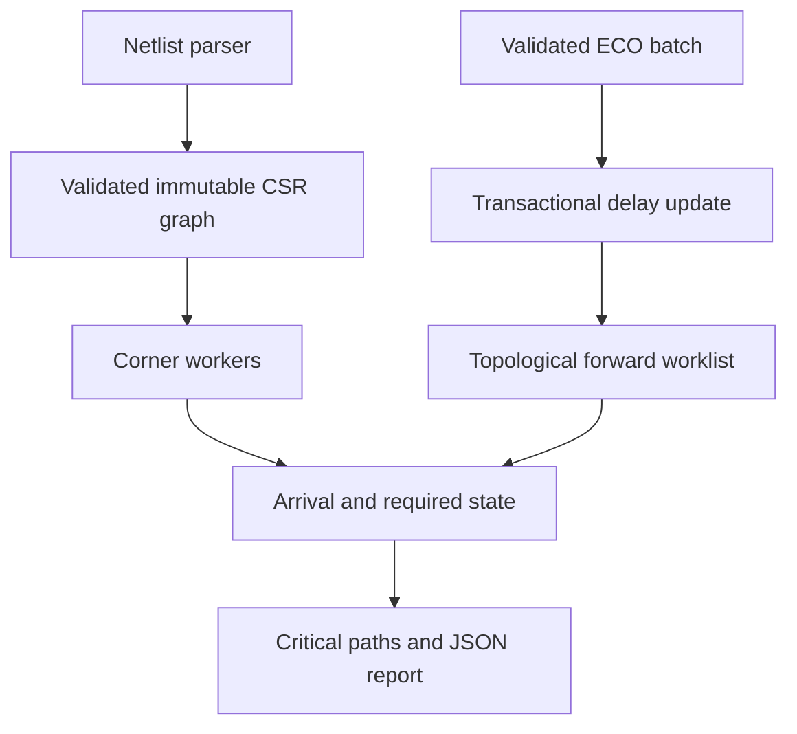
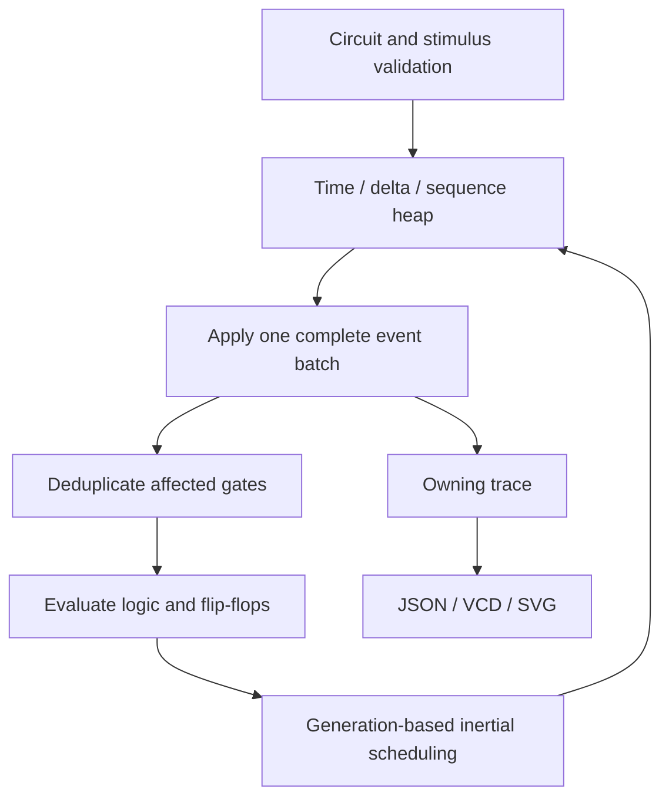

# Architecture and decisions

## TimingForge

**Why CSR?** Arc IDs live in contiguous vectors and each node has a span into them. This avoids a heap allocation for every adjacency list and makes the traversal explicit. The construction phase temporarily uses counters and hash indexes, then freezes the topology.

**Why both incoming and outgoing adjacency?** Incoming edges enable exact recomputation when a formerly critical edge becomes faster. Merely propagating positive deltas would miss a new winning predecessor. Outgoing edges identify which downstream nodes may need work.

**Why topological priority?** For any scheduled node, an affected ancestor must have a lower topological rank. Processing smaller ranks first ensures all relevant predecessors have been recomputed before a node is popped. Each node is queued at most once per update batch. If arrival values do not change, its descendants do not require recomputation. Predecessor ties are still updated locally, so later path reconstruction sees a changed equal-time path.

**Why a full reverse pass?** Required-time changes can spread through a different cone than arrival changes. Keeping that pass simple avoids an invalid claim of complete incremental timing. Rollback snapshots also cost linear memory traffic. Further optimization needs a transaction log and separate reverse worklist, backed by randomized state comparisons.

**Why relaxed atomics?** The counter only gives each worker a distinct result index. It does not publish graph data. Thread creation makes the read-only inputs visible; joining `jthread`s synchronizes completed results. Workers write different existing vector elements and never resize the vector. Exception publication uses a mutex.

**Failure policy:** validate domain errors before mutation; detect nonfinite accumulated times; restore ECO state using nonthrowing vector swaps after propagation failures. Caller ownership of the shared immutable graph prevents dangling spans inside an engine. Public graph accessors return borrows whose lifetime is the graph's lifetime.

## LogicScope

**Why lazy cancellation?** A priority queue has no efficient general erase API. Generation tags make pending events cheap to invalidate without retaining pointers into a reallocating container. Canceled events remain in the heap until popped; stale-event and peak-queue counters expose this cost. Both pending and processed-event budgets remain necessary under high cancellation rates.

**Why batch before evaluation?** Evaluating after each input assignment could introduce an artificial XOR glitch when two equal-time inputs switch together. Applying a full batch gives every gate the same input snapshot. Declaration order then gives deterministic scheduling for newly generated events. Primary-input transition order in the trace still follows stimulus insertion order; final gate outputs are invariant to reordering equal-time input lines.

**Why no raw owning pointers?** Nets, gates, state, and events have clear value ownership in vectors and queues. IDs survive reallocations; references do not escape mutating containers. The only stored reference is the simulator's borrowed immutable circuit, and its lifetime is explicit in the API.

**Why keep all transitions?** Owning traces make replay, JSON/VCD cross-checks, and waveform generation simple. The cost is `O(transitions)` memory and unsuitable behavior for unbounded long simulations. A future sink callback or chunked writer can lower memory, but must define error propagation and partial-file semantics first.

## What these implementations do not prove

Passing tests does not prove silicon timing validity, HDL standard compliance, race freedom under every scheduler, or production security. The synthetic benchmark does not measure parser throughput, storage I/O, commercial EDA performance, or real-chip capacity. Interfaces, negative tests, and recorded evidence make the work inspectable and extensible.
